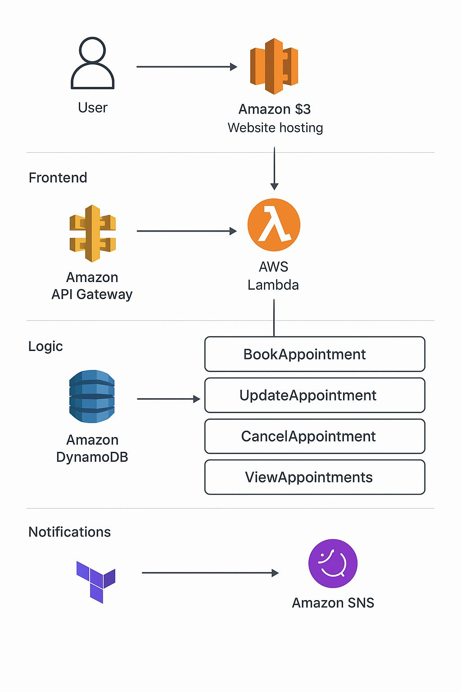

# 🩺 Serverless Doctor Appointment Booking System

## Overview
This is a **Serverless Doctor Appointment Booking System** built on **AWS**. It allows patients to **book, update, cancel, and view appointments** seamlessly via a web interface. The system is fully **serverless**, leveraging AWS managed services for scalability, reliability, and cost-efficiency.

After completing my **AWS SAA Certification**, I deepened my knowledge in **Infrastructure as Code (IaC)** using **Terraform**, and applied it to this project to automate the deployment of all AWS resources.

---

## 🚀 Features
- 🗓 **Book appointments** with doctors
- ✏️ **Update appointment details**
- ❌ **Cancel appointments**
- 👀 **View existing appointments**
- 🔔 **Email notifications** for confirmations and cancellations using **AWS SNS**
- 💻 Fully serverless architecture: no server management required
- 🌱 Infrastructure deployed via **Terraform** for reproducibility

---

## 🛠️ Technology Stack
- **Frontend:** HTML, CSS, JavaScript (hosted on **AWS S3**)
- **Backend:** AWS **API Gateway** + **AWS Lambda**
- **Database:** AWS **DynamoDB**
- **Notifications:** AWS **SNS**
- **Infrastructure:** **Terraform** (IaC)

---

## 📦 Architecture Diagram
  
*Diagram created with AWS service logos & Terraform logo.*

---

## ⚙️ Deployment
### 1. Clone the repository
```bash
git clone https://github.com/yourusername/doctor-appointment-system.git
cd doctor-appointment-system

